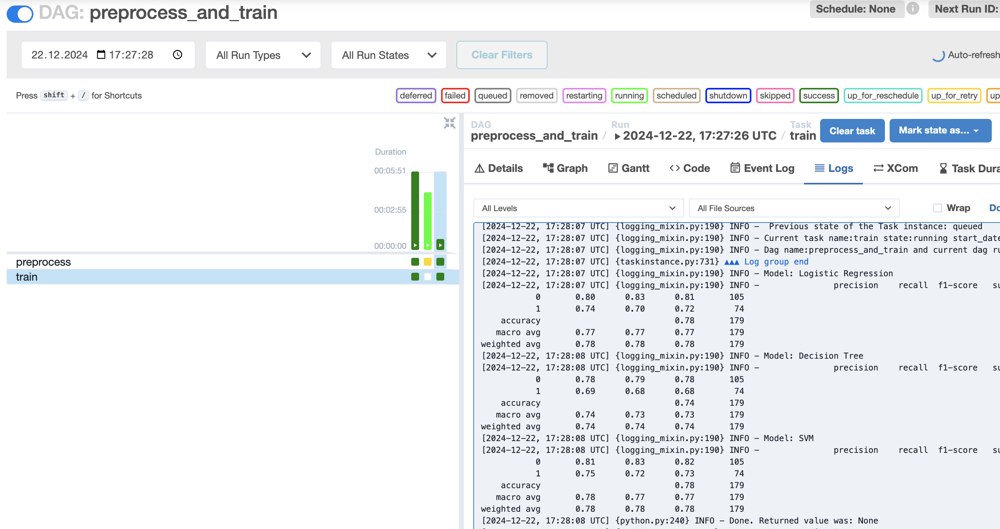
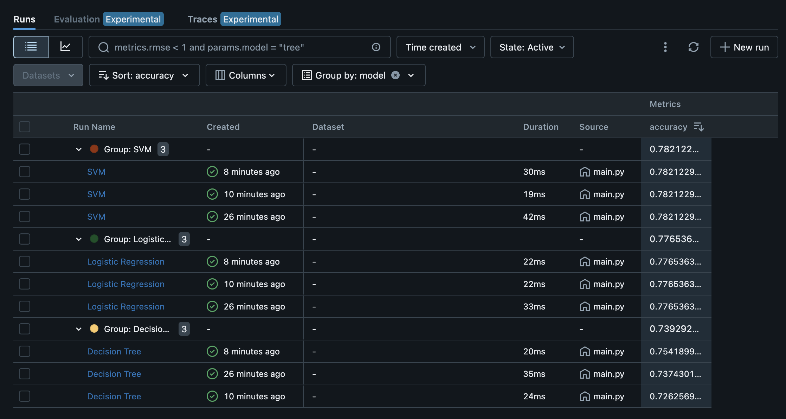

# Проект 'Титаник'

## Структура проекта

- `data` - данные для обучения и валидации моделей
- `src` - исходный код проекта
- `models` - сериализованные модели после обучения

## Linter & formatters

Примеменены де-факто стандарты индустрии. Их конфигурационные файлы находятся в корне проекта

- `black`
- `isort`
- `ruff` (относительно новый инструмент на замену `flake8`)
- `pre-commit` - используемдля валидации кодовой базы перед `git commit`

## Pipelines

Реализованы пайплайны обучения моделей `src/train.py` и препроцессинга данных `src/preprocess.py`. Целью проекта не стояло сделать самую лучшую модель, реализованы только базовые модели `LogisticRegression, DecisionTreeClassifier, SVC`.

Конфигурируемые запуски `airflow`. Поднимаем через `airflow scheduler` + `airflow webserver`. Конфигурацию `airflow.cfg` опускаю, не вижу в этом необходимости.

## Mlflow

Все запуски пишут в локальное хранилище `mlflow` в папку `./mlruns` (в реальных проектах это удаленной хранилище артефактов)

- Запуск фронтенда инструмента:
`mlflow ui --backend-store-uri ./mlruns`

## Package managers

Используем более новую альтернативу `conda` - `miniforge` (переделка бывшей `mamba`). Окружение в формате `yml` и `explicit` лежат в корне проекта.

## Data & code versioning

Для версионирования кода используем стандартный `Git` репозиторий.

Используем DVC в связке с локальным хранилищем
`dvc remote add --default -f mle_local ~/dvc_local`
